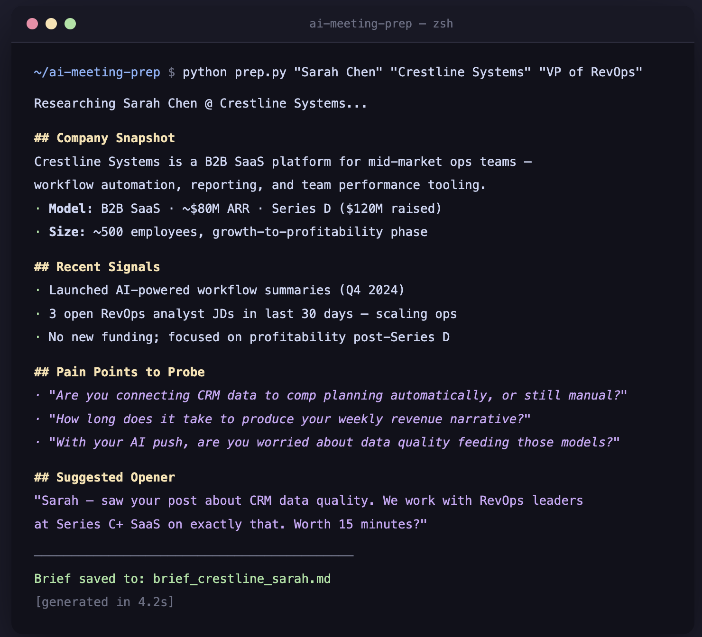

# AI Meeting Prep Agent

> AI agent that generates a full pre-call research brief in seconds — company snapshot, pain points, tailored questions, CRM context, and a suggested opening line.

Built for Account Executives and founders who do their own selling — and don't have 45 minutes to prep for every call.

---

## How It Works

1. Input a prospect's name, company, and optional role
2. The agent synthesizes a structured research brief using Claude AI
3. Brief streams live to your terminal and saves as a `.md` file
4. Optional: paste your CRM notes via `--crm-notes` for a personalized brief

> **Note on Recent News:** The "Recent News & Signals" section is synthesized from AI training data, not live web search. For the freshest signals, re-run the brief closer to your call date.

---

## Demo



```bash
$ python prep.py "Jordan Kim" "Crestline Systems" "VP of RevOps"

Researching Jordan Kim @ Crestline Systems...

## Company Snapshot
Crestline Systems is a B2B SaaS platform for mid-market ops teams —
workflow automation, reporting, and performance tooling.
· Model: B2B SaaS · ~$80M ARR · Series D
· Size: ~500 employees, growth-to-profitability phase

## Recent News & Signals
· Launched AI-powered workflow summaries (Q4 2024)
· 3 open RevOps analyst JDs — actively scaling ops team
· No new funding; focused on profitability post-Series D

## CRM Context
· No prior interactions on record

## Pain Points to Probe
· "Are you connecting CRM data to comp planning automatically, or still manual?"
· "How long does it take to produce your weekly revenue narrative?"
· "With your AI push, are you worried about data quality feeding those models?"

## Suggested Opening
"Jordan — saw your post about CRM data quality. We work with RevOps leaders
at Series C+ SaaS on exactly that. Worth 15 minutes?"

---
Brief saved to: brief_crestline_jordan.md  [generated in 4.2s]
```

---

## Try the demo (no API key needed)

```bash
python demo.py
```

---

## Setup

```bash
pip install -r requirements.txt
```

Copy `.env.example` to `.env` and add your API key:

```bash
cp .env.example .env
# then edit .env and set ANTHROPIC_API_KEY=sk-ant-...
```

---

## Usage

```bash
# Basic
python prep.py "Prospect Name" "Company"

# With role for sharper targeting
python prep.py "Jordan Kim" "Crestline Systems" "VP of RevOps"

# With CRM context
python prep.py "Jordan Kim" "Crestline Systems" "VP of RevOps" \
  --crm-notes "Met at SaaStr 2024. Interested in pipeline analytics. Objection: already using Clari."
```

Brief streams live and saves as `brief_<company>_<firstname>.md`.

---

## Brief Sections

| Section | What it covers |
|---------|---------------|
| Company Snapshot | What they do, size, stage, business model |
| Recent News & Signals | Funding, hires, launches, layoffs |
| Tech Stack (Likely) | CRM, marketing automation, sales tools |
| CRM Context | Prior interactions, open opps, known objections |
| Pain Points to Probe | 3 questions framed for the call |
| Talking Points | 3 value angles tied to their situation |
| Red Flags | Reasons this might be a hard sell |
| Suggested Opening | One sentence to start the call strong |

---

## Stack

- Python 3.10+
- [Anthropic Claude API](https://docs.anthropic.com) (`claude-sonnet-4-6`) with streaming

---

## Why This Matters

The average AE spends 20–30 minutes on pre-call research scattered across LinkedIn, Google, and Crunchbase. This agent does it in under 30 seconds. For a 10-person sales team making 3 calls/day, that's 22+ hours of research time recovered every week.

---

Built by [Henry Tran](https://linkedin.com/in/gethenry) | [RevOps Marketing](https://revopsmarketing.net)
Part of an open-source suite of AI agents for revenue teams.
